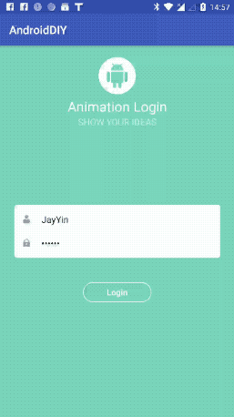
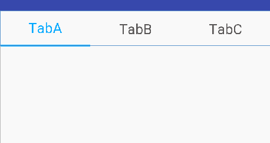
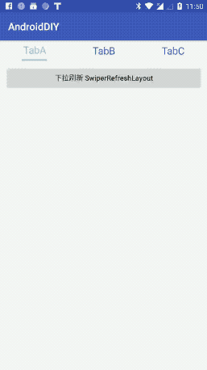

**我的Android DIY**

------
一、Aandroid自定义控件（View）

1. 自定义登录动画效果（非原创）
    说明：
                两个控件的各自动画效果叠加，注意尺寸，会影响动画衔接处的效果！

        
        
        2. 自定义TabButton单选按钮 YinTabButton  【Kotlin | 原创】 
            版本：v1.0.0
            基本功能：   
                        可直接xml布局中使用；
                        只支持点击OnClick,不支持滑动(至于其他的操作，可随意添加接口并实现即可完成)；
                        随意设定title内容和数量，文字大小等常用属性；
                        随意设置标签指示器indicators的宽高颜色
            说明：未提供xml的属性配置，暂时通过代码中setXXX来设置各种属性；具体见代码 /views/YinTabButton；
            使用：暂时直接复制源代码到项目中即可；

            
            
            
        3. Android自带下拉刷新控件 SwipeRefreshLayout 使用
            说明：
                "此布局应作为视图的父级，将作为手势的结果进行刷新，并且只能支持一个直接子级"，该控件内部只能直接包含一个支持滑动的子控件（Recyclerview 、ListView、ScrollerView等）
            此处用的是 RecyclerView，效果如下：

        

                
             